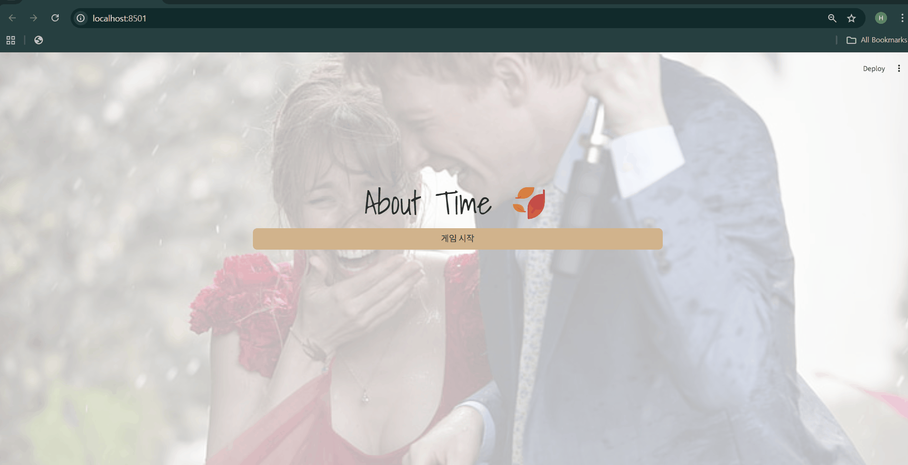
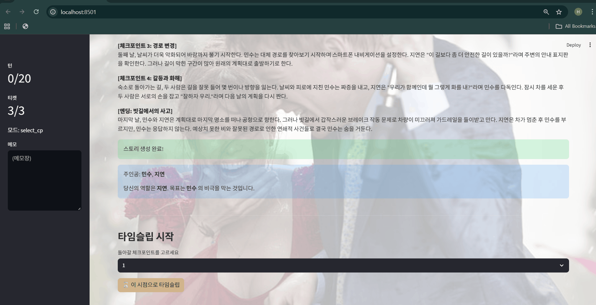
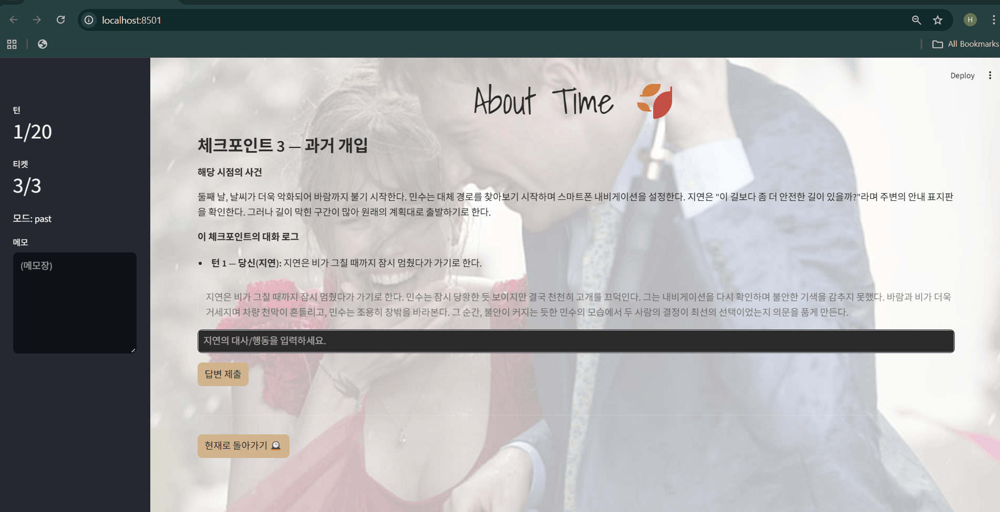

# About Time 🍂

## 게임 개요
About Time은 플레이어가 시간을 되돌려 연인의 비극적인 결말을 막기 위해 개입하는 **인터랙티브 스토리텔링** 게임입니다.
모든 이야기는 대한민국을 배경으로 전개되며, 두 인물 사이에서 벌어지는 구체적 사건들이 점차 누적되어 **비극적 엔딩**으로 이어집니다.

플레이어는 한쪽 인물의 시점을 맡아, **과거의 특정 체크포인트(Checkpoint)**로 돌아가 발언이나 행동을 바꾸면서 결말을 변화시킬 기회를 얻습니다.

## 기본 룰
#### 스토리 생성
- 게임 시작 시 GPT가 5개의 문단으로 구성된 이야기를 생성합니다.
- 각 문단은 [체크포인트 1] ~ [체크포인트 4], 그리고 [엔딩]으로 이루어집니다.

#### 체크포인트 선택
- 플레이어는 엔딩을 확인한 뒤, 티켓 🎟️을 사용하여 원하는 체크포인트로 돌아갈 수 있습니다.
- 체크포인트는 이야기를 바꿀 수 있는 개입 시점을 의미합니다.

#### 턴 진행
- 플레이어는 20턴 동안만 개입할 수 있습니다.
- 각 턴에서 플레이어는 대사/행동을 입력하고, GPT가 상대 인물의 반응과 사건 전개를 만들어냅니다.
- 개입 결과에 따라 **위험도(risk)**가 변하며, 결말에 영향을 줍니다.

#### 결말 확인
- 모든 턴이 끝나거나 플레이어가 현재로 돌아오면, 새로운 엔딩이 생성됩니다.
- 플레이어가 위험도를 충분히 낮추고(≤ -2), 최소 2개 이상의 사건을 개선했다면 비극을 막을 수 있는 해피 엔딩을 볼 수 있습니다.
- 그렇지 못하면 비극적 결말이 이어집니다.

## 플레이 목표
- 제한된 턴과 티켓을 활용해 최소 2개 이상의 위험 사건을 성공적으로 개선하고,
- 위험도를 충분히 낮춰 연인의 비극적 죽음을 막는 것이 목표입니다.

## 데모 결과

  
